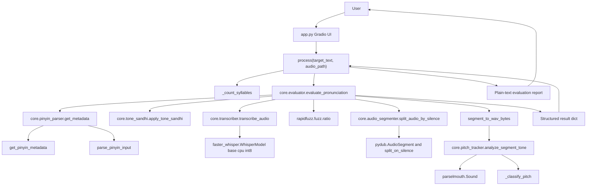
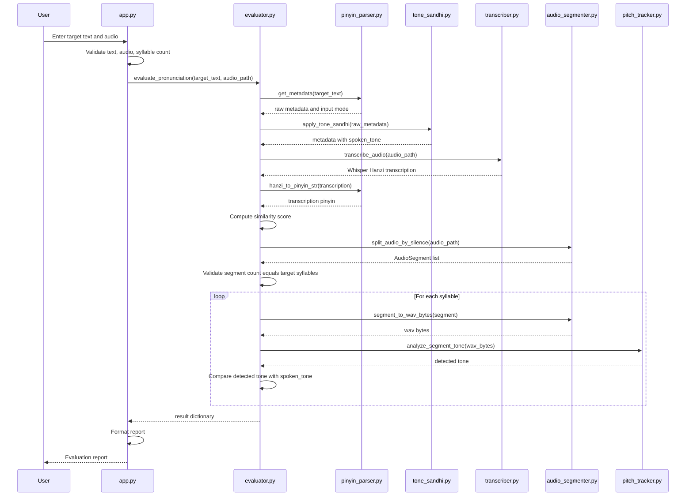
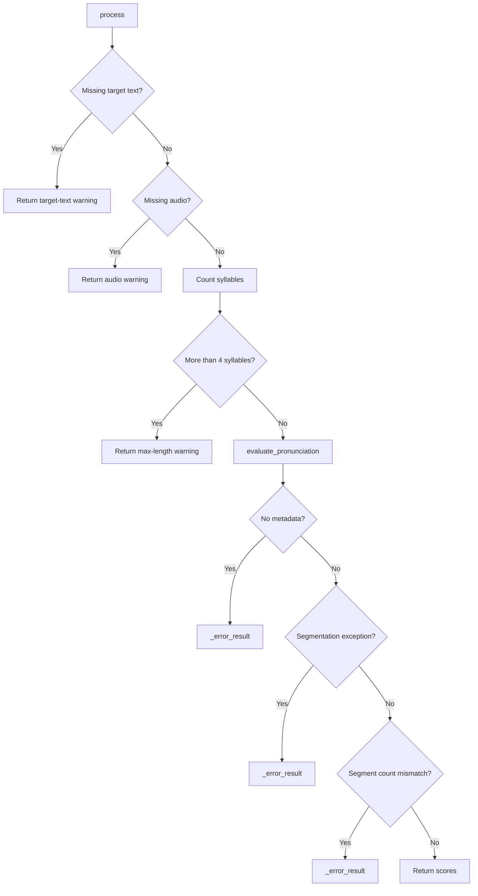
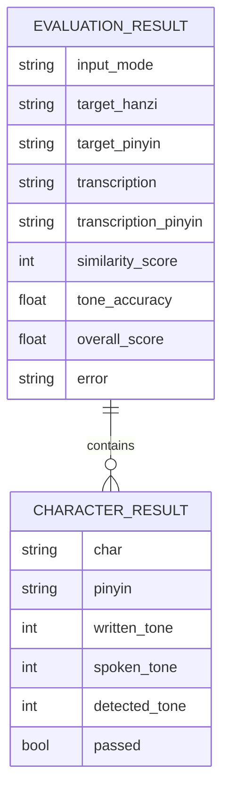
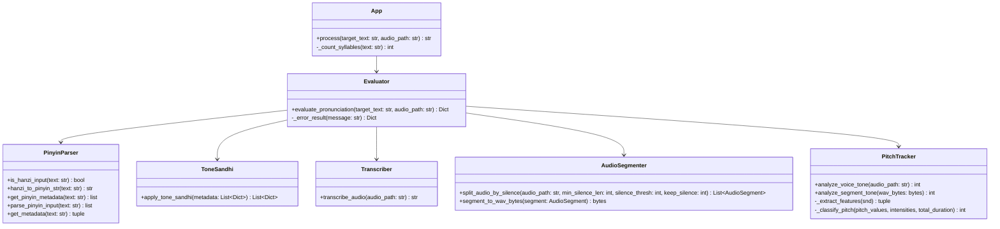
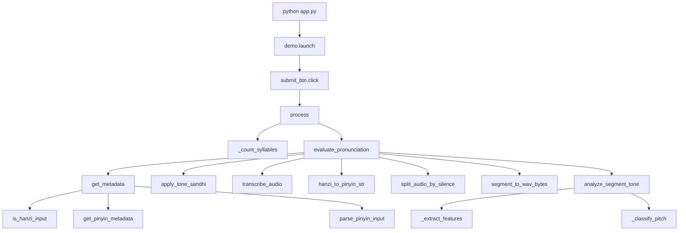

# Mandarin Pronunciation Evaluator Wiki

## 1. Project Overview

Mandarin Pronunciation Evaluator is a local Python application for assessing short Mandarin pronunciation samples. The user enters a target word or phrase in Hanzi or pinyin, uploads or records audio, and receives text-match, per-syllable tone, and overall pronunciation scores.

### Analysis Method

- Language detected: Python
- Detection basis: `requirements.txt`, `app.py`, and the `core/` Python package
- LSP status: no Python LSP executable (`pyright-langserver`, `pylsp`, or `jedi-language-server`) was available in the current environment
- Fallback used: static source inspection, symbol scanning, imports, function signatures, docstrings, and call-flow analysis

### Tech Stack

| Layer | Technology | Purpose |
|---|---|---|
| UI | Gradio | Browser-based local interface |
| Speech recognition | faster-whisper | Mandarin audio transcription |
| Audio segmentation | pydub | Split utterances into syllable-sized chunks by silence |
| Pitch analysis | praat-parselmouth, numpy | Extract F0/intensity features and classify tones |
| Pinyin conversion | pypinyin | Convert Hanzi to tone-number pinyin and normalize pinyin input |
| Text similarity | RapidFuzz | Compare target text/pinyin with Whisper output |
| Runtime/API support | fastapi, uvicorn, gradio_client | Gradio server stack dependencies |

### Primary Capability

The application supports short utterances of 1 to 4 syllables and evaluates:

- Hanzi or pinyin target input
- Faster-Whisper Mandarin transcription
- Target/transcription similarity
- Tone sandhi expectations
- Per-syllable tone classification
- Weighted overall score

## 2. Architecture



### Architectural Notes

- `app.py` owns UI validation, report formatting, and Gradio wiring.
- `core/evaluator.py` is the orchestration boundary. The UI calls only `evaluate_pronunciation`.
- `core/pinyin_parser.py` normalizes target input into metadata.
- `core/tone_sandhi.py` converts written tones into expected spoken tones.
- `core/transcriber.py` wraps a module-level Faster-Whisper model initialized once at import time.
- `core/audio_segmenter.py` uses silence boundaries to align audio chunks with target syllables.
- `core/pitch_tracker.py` classifies each syllable's tone from pitch and intensity features.

## 3. Project Structure

```text
oral_pronunciation_assessment/
|-- app.py
|-- README.md
|-- requirements.txt
|-- WIKI.md
`-- core/
    |-- __init__.py
    |-- audio_segmenter.py
    |-- evaluator.py
    |-- pitch_tracker.py
    |-- pinyin_parser.py
    |-- tone_sandhi.py
    `-- transcriber.py
```

Excluded from this view: `.git/`, `.idea/`, `__pycache__/`, virtual environments, build outputs, and generated dependency directories.

## 4. Core Components

### `app.py`

The Gradio entry point. It validates user input, limits evaluation to at most four syllables, calls the evaluator, and formats a human-readable report.

Important symbols:

| Symbol | Type | Description |
|---|---|---|
| `_TONE_LABEL` | dict | Display labels for tones 0 through 5 |
| `_count_syllables(text)` | function | Counts Hanzi characters or space-separated pinyin tokens |
| `process(target_text, audio_path)` | function | Main UI callback; returns a text report |
| `_INSTRUCTIONS` | str | Markdown shown in the Gradio page |
| `demo` | `gr.Blocks` | Gradio application instance |

### `core/evaluator.py`

Central evaluation service. It returns a structured dictionary for both success and error paths.

Responsibilities:

- Parse target input as Hanzi or pinyin.
- Apply tone sandhi.
- Transcribe uploaded audio.
- Compare target and transcription in the appropriate domain.
- Split audio into syllable segments.
- Run tone classification per segment.
- Compute tone accuracy and weighted overall score.

Scoring constants:

| Constant | Value | Meaning |
|---|---:|---|
| `_TEXT_WEIGHT` | `0.4` | Weight for text similarity |
| `_TONE_WEIGHT` | `0.6` | Weight for tone accuracy |
| `_TEXT_PASS_THRESHOLD` | `80` | Declared threshold; currently not used in final scoring logic |

### `core/pinyin_parser.py`

Input normalization layer for Hanzi and pinyin.

Metadata entry shape:

```python
{
    "char": str | None,
    "pinyin": str,
    "written_tone": int,
}
```

For pinyin input, `char` is `None` because pinyin does not uniquely identify a Hanzi character.

### `core/tone_sandhi.py`

Adds `spoken_tone` to each metadata entry without mutating the original input list.

Implemented rules:

| Rule | Input Pattern | Spoken Tone Change |
|---|---|---|
| Third tone sandhi | tone 3 before tone 3 | first tone becomes 2 |
| `bu4` sandhi | `bu4` before tone 4 | `bu2` |
| `yi1` before tone 4 | `yi1` before tone 4 | `yi2` |
| `yi1` before tone 1/2/3/5 | `yi1` before non-tone-4 | `yi4` |
| Neutral tone | written tone 5 | unchanged |

### `core/transcriber.py`

Thin Faster-Whisper wrapper.

- Initializes `WhisperModel("base", device="cpu", compute_type="int8")` at import time.
- `transcribe_audio(audio_path)` returns a stripped Mandarin transcription string.
- Empty audio path returns an empty string.

### `core/audio_segmenter.py`

Splits audio into syllable-like chunks using pydub silence detection.

Default segmentation parameters:

| Parameter | Default | Meaning |
|---|---:|---|
| `min_silence_len` | `150` ms | Minimum gap considered a syllable boundary |
| `silence_thresh` | `-40` dBFS | Volume threshold considered silence |
| `keep_silence` | `100` ms | Preserved silence around segments |
| `_MIN_SEGMENT_MS` | `80` ms | Minimum retained segment duration |

### `core/pitch_tracker.py`

Extracts pitch, intensity, and duration using Parselmouth, then classifies tone with heuristics.

Tone classification constants:

| Constant | Value | Meaning |
|---|---:|---|
| `_FLAT_VAR` | `150` | Low variance threshold for tone 1 |
| `_RISE_DELTA` | `15` | Rising pitch threshold for tone 2 |
| `_FALL_DELTA` | `-15` | Falling pitch threshold for tone 4 |
| `_MIN_VOICED` | `5` | Minimum voiced frames |
| `_MAX_NEUTRAL_DURATION` | `0.18` sec | Short-duration neutral tone heuristic |
| `_MIN_NEUTRAL_DROP` | `8.0` dB | Intensity drop heuristic for neutral tone |

Classification order:

1. Return tone `0` if too few voiced frames are detected.
2. Return tone `5` if the segment is short and intensity fades enough.
3. Return tone `1` for low pitch variance.
4. Return tone `2` for sufficient rising pitch.
5. Return tone `4` for sufficient falling pitch.
6. Return tone `3` as the remaining contour class.

## 5. Data Flow



### Error Flow



## 6. Data Model

The project uses dictionaries rather than custom classes or database models.

### Entity Relationship View



### Class Diagram View



### Result Dictionary Schema

```python
{
    "input_mode": "hanzi" | "pinyin" | "unknown",
    "target_hanzi": str | None,
    "target_pinyin": str,
    "transcription": str,
    "transcription_pinyin": str,
    "similarity_score": int,
    "character_results": [
        {
            "char": str | None,
            "pinyin": str,
            "written_tone": int,
            "spoken_tone": int,
            "detected_tone": int,
            "passed": bool,
        }
    ],
    "tone_accuracy": float,
    "overall_score": float,
    "error": str | None,
}
```

## 7. API Reference

### Application API

#### `app.process(target_text: str, audio_path: str) -> str`

Main Gradio callback.

Parameters:

- `target_text`: Hanzi or pinyin target text.
- `audio_path`: local path supplied by Gradio audio upload/recording.

Returns:

- Plain-text report on success.
- Plain-text warning if validation or evaluation fails.

Validation:

- Rejects empty target text.
- Rejects missing audio.
- Rejects zero detected syllables.
- Rejects more than four syllables.

#### `app._count_syllables(text: str) -> int`

Counts CJK characters for Hanzi input or whitespace-separated tokens for pinyin input.

### Evaluation API

#### `core.evaluator.evaluate_pronunciation(target_text: str, audio_path: str) -> Dict[str, Any]`

The main service function. Returns a structured result dictionary.

Success conditions:

- Input parses into metadata.
- Audio transcribes successfully or returns an empty transcription string.
- Audio segmentation returns exactly one segment per expected syllable.
- Each segment is analyzed for tone.

Error conditions:

- Unparseable input.
- Audio segmentation exception.
- Number of detected speech segments differs from expected syllable count.

#### `core.evaluator._error_result(message: str) -> Dict[str, Any]`

Internal helper that returns a zero-score result with `error` populated.

### Pinyin Parser API

#### `core.pinyin_parser.is_hanzi_input(text: str) -> bool`

Returns true if any character is in the CJK Unified Ideographs range.

#### `core.pinyin_parser.hanzi_to_pinyin_str(text: str) -> str`

Converts Hanzi into space-separated tone-number pinyin using neutral tone `5`.

Example:

```python
hanzi_to_pinyin_str("<two Hanzi characters>")  # "ni3 hao3"
```

#### `core.pinyin_parser.get_pinyin_metadata(text: str) -> list`

Converts Hanzi into metadata entries with `char`, base `pinyin`, and `written_tone`.

#### `core.pinyin_parser.parse_pinyin_input(text: str) -> list`

Parses whitespace-separated pinyin tokens. Supports tone numbers and tone marks through `to_tone3`.

#### `core.pinyin_parser.get_metadata(text: str) -> tuple`

Routes to Hanzi or pinyin parsing.

Returns:

```python
(metadata_list, "hanzi" | "pinyin")
```

### Tone Sandhi API

#### `core.tone_sandhi.apply_tone_sandhi(metadata: List[Dict[str, Any]]) -> List[Dict[str, Any]]`

Returns copied metadata entries with a new `spoken_tone` key.

Input is not mutated.

### Transcription API

#### `core.transcriber.transcribe_audio(audio_path: str) -> str`

Transcribes audio with Faster-Whisper in Mandarin mode.

Behavior:

- Returns `""` for missing audio path.
- Joins all Whisper segments into one string.
- Strips common Chinese punctuation from the final string.

### Audio Segmentation API

#### `core.audio_segmenter.split_audio_by_silence(audio_path: str, min_silence_len: int = 150, silence_thresh: int = -40, keep_silence: int = 100) -> List[AudioSegment]`

Loads audio with pydub, converts it to mono, and splits on silence.

Returns:

- A list of `pydub.AudioSegment` objects.
- Segments shorter than 80 ms are discarded.

#### `core.audio_segmenter.segment_to_wav_bytes(segment: AudioSegment) -> bytes`

Exports a pydub segment into in-memory WAV bytes.

### Pitch Tracking API

#### `core.pitch_tracker.analyze_voice_tone(audio_path: str) -> int`

Analyzes a file on disk and returns tone `0` through `5`.

#### `core.pitch_tracker.analyze_segment_tone(wav_bytes: bytes) -> int`

Analyzes in-memory WAV bytes and returns tone `0` through `5`.

Implementation detail:

- Writes bytes to a temporary `.wav` file because `parselmouth.Sound` is used with a path.
- Deletes the temporary file in a `finally` block.

#### `core.pitch_tracker._extract_features(snd: parselmouth.Sound)`

Internal helper that extracts:

- Voiced pitch frequencies
- Intensity values
- Sound duration

#### `core.pitch_tracker._classify_pitch(pitch_values: np.ndarray, intensities: np.ndarray, total_duration: float) -> int`

Internal tone classifier. Returns:

| Return | Meaning |
|---:|---|
| `0` | Undetected, too short, or silent |
| `1` | Flat/high-level tone |
| `2` | Rising tone |
| `3` | Dip-rise/catch-all contour |
| `4` | Falling tone |
| `5` | Neutral tone |

## 8. Configuration

This project currently uses module constants rather than external configuration files.

### Runtime Configuration Points

| File | Setting | Current Value |
|---|---|---|
| `core/transcriber.py` | Whisper model | `base` |
| `core/transcriber.py` | Device | `cpu` |
| `core/transcriber.py` | Compute type | `int8` |
| `core/audio_segmenter.py` | Minimum silence length | `150` ms |
| `core/audio_segmenter.py` | Silence threshold | `-40` dBFS |
| `core/audio_segmenter.py` | Kept boundary silence | `100` ms |
| `core/audio_segmenter.py` | Minimum retained segment | `80` ms |
| `core/evaluator.py` | Text weight | `0.4` |
| `core/evaluator.py` | Tone weight | `0.6` |
| `core/pitch_tracker.py` | Neutral max duration | `0.18` sec |
| `core/pitch_tracker.py` | Neutral intensity drop | `8.0` dB |

### External Requirements

Install Python packages from:

```bash
pip install -r requirements.txt
```

Audio handling may require ffmpeg/libav availability through the environment, because pydub and Faster-Whisper audio decoding depend on it.

## 9. Getting Started

### Prerequisites

- Python 3.10 or newer is recommended.
- A working local audio stack for Gradio microphone input.
- ffmpeg/libav available for audio decoding.

### Install

```bash
git clone https://github.com/FeisalDy/oral_pronunciation_assessment
cd oral_pronunciation_assessment
python -m venv .venv
source .venv/bin/activate
pip install -r requirements.txt
```

On Windows PowerShell:

```powershell
python -m venv .venv
.\.venv\Scripts\Activate.ps1
pip install -r requirements.txt
```

### Run

```bash
python app.py
```

Then open the local Gradio URL printed by the application.

### Typical Usage

1. Enter a target in Hanzi, numeric pinyin, or tone-mark pinyin.
2. Record or upload a short audio sample.
3. Pause briefly between syllables when speaking.
4. Click Evaluate.
5. Review transcription similarity, per-syllable expected/detected tones, tone accuracy, and overall score.

## 10. Development Guide

### Main Extension Points

| Goal | File to Change | Notes |
|---|---|---|
| Change UI behavior/report text | `app.py` | Keep evaluator result schema stable |
| Add input normalization rules | `core/pinyin_parser.py` | Preserve metadata shape |
| Add tone sandhi rules | `core/tone_sandhi.py` | Return copied metadata, do not mutate input |
| Tune segmentation | `core/audio_segmenter.py` | Adjust silence thresholds and minimum segment duration |
| Tune tone classification | `core/pitch_tracker.py` | Adjust F0/intensity heuristics |
| Change ASR model/device | `core/transcriber.py` | Update `WhisperModel` initialization |
| Change scoring formula | `core/evaluator.py` | Update weights and score calculation |

### Call Hierarchy



### Adding a New Evaluator Field

1. Add the field in `core/evaluator.py` success return.
2. Add a compatible default in `_error_result`.
3. Update `app.process` if the field should be displayed.
4. Update this wiki's result schema.

### Improving Tone Detection

The current pitch classifier is heuristic. A more robust implementation could:

- Normalize pitch per speaker.
- Smooth pitch contours before classification.
- Detect tone 3 with a more explicit low-dip/rise contour rule.
- Use forced alignment instead of silence-only segmentation.
- Include confidence values for tones.

### Testing Recommendations

No test suite is currently present. Suggested first tests:

- Unit tests for `parse_pinyin_input`.
- Unit tests for `apply_tone_sandhi`.
- Unit tests for `_count_syllables`.
- Contract tests for `evaluate_pronunciation` with mocked transcription, segmentation, and pitch detection.
- Fixture-based audio tests for segmentation edge cases.

### Known Limitations

- Maximum supported target length is four syllables.
- Segmentation requires brief pauses between syllables.
- Tone classification is based on simple pitch/intensity heuristics.
- No forced alignment or phoneme-level scoring is implemented.
- Pinyin input cannot infer a unique target Hanzi string.
- Whisper transcription is initialized at import time, which may slow initial application startup.

### Suggested Refactors

- Introduce typed dictionaries or dataclasses for metadata and result schemas.
- Move scoring and segmentation thresholds into a configuration object.
- Lazy-load the Whisper model on first transcription call.
- Add structured logging around segmentation and pitch classification.
- Add an automated test suite before changing tone heuristics.
